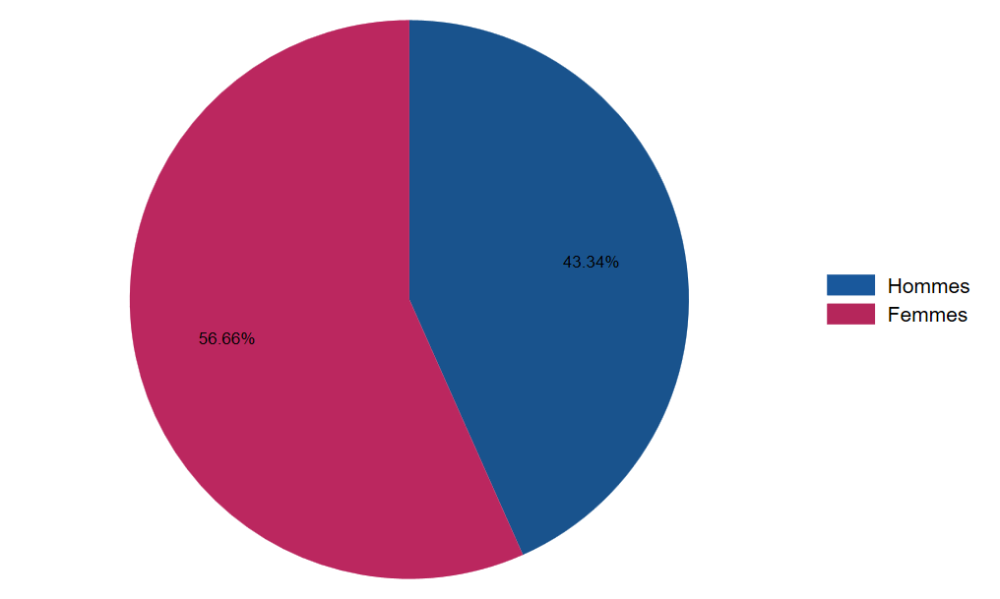
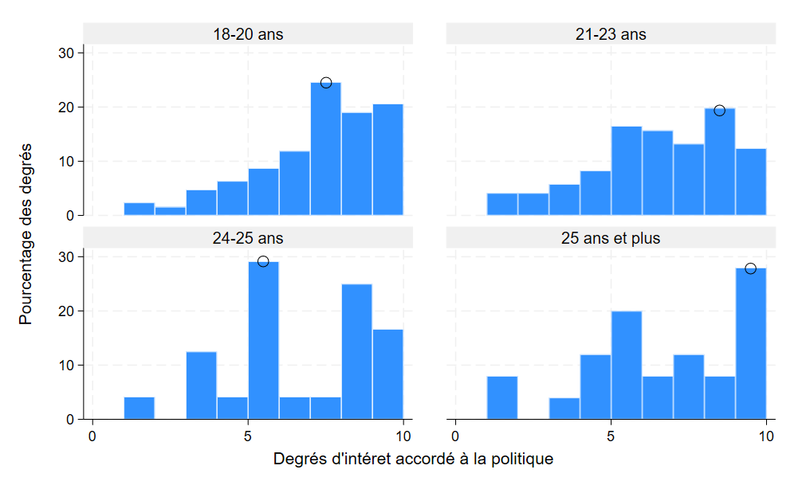

# Réseaux sociaux et engagement politique chez les jeunes adultes

*Survey-based statistical analysis (Stata) of the relationship between social media use and political engagement among young adults in France — chi-square tests and block regressions on original survey data. English summary below.*

Projet réalisé en solo dans le cadre du Master 1 Data Analyst (IAE
Paris-Est, Université Gustave Eiffel), sous la direction de Monsieur
Yannick L'Horty.

## Problématique

Comment l'exposition aux réseaux sociaux influence-t-elle l'engagement
politique des jeunes adultes, et ce lien varie-t-il selon le genre, le
type de contenu suivi ou la plateforme utilisée ?

## Données

Enquête originale conçue et administrée personnellement via un
[questionnaire Google Forms](https://docs.google.com/forms/d/e/1FAIpQLSciSNwmXYTCl4dVjqrz8jX_qD1oFmGaAwMcOT82_mMiL9I31g/viewform),
diffusé sur plusieurs réseaux sociaux et auprès de deux universités
(UBFC, Université Gustave Eiffel) le 21 octobre 2024. 320 réponses
collectées, 296 retenues après nettoyage (valeurs aberrantes, doublons).
Les réponses sont anonymes ; les questions ouvertes ont été recodées en
modalités pour l'analyse (aucune réponse libre individuelle n'est publiée
telle quelle).

Les 296 observations couvrent le profil socio-démographique des
répondants (âge, genre, niveau d'éducation, situation professionnelle),
leurs habitudes sur les réseaux sociaux (temps passé, plateformes,
exposition à des opinions divergentes, désinformation), et plusieurs
indicateurs d'engagement politique (intérêt pour la politique, taux de
participation aux élections, confiance dans l'information politique sur
les réseaux).

## Démarche

1. **Portrait statistique** de l'échantillon (répartition par genre,
   âge, niveau d'éducation, plateformes utilisées)
2. **Tests d'indépendance du Khi²** (70 tests au total) entre les
   variables liées aux réseaux sociaux (X) et les indicateurs
   d'engagement politique (Y), avec réplication par sous-population
   (hommes / femmes)
3. **Régressions simples** exploratoires sur l'ensemble des couples X/Y
4. **Régressions multiples par blocs** — ajout progressif de
   caractéristiques personnelles, puis d'usage des réseaux sociaux, puis
   de comportements actifs (partage, plateformes), pour isoler l'effet
   propre de chaque facteur
5. **Diagnostics du modèle retenu** — test de Breusch-Pagan
   (hétéroscédasticité), facteurs d'inflation de la variance (VIF,
   multicolinéarité), normalité des résidus (QQ-plot)

## Résultats clés

L'échantillon est composé à 56,7 % de femmes, avec une nette
surreprésentation des 18-24 ans (cohérente avec l'objet de l'étude) et
une population majoritairement diplômée (Bac à Bac+5) :



L'intérêt pour la politique varie selon l'âge, avec des pics marqués chez
les 18-20 ans et les 25 ans et plus :



Le modèle de régression multiple final (R² ajusté = 27 %) montre que le
facteur le plus robuste est le **comportement d'information** : les
répondants qui s'informent au-delà des seuls programmes électoraux
votent significativement plus (p < 0,01), tout comme ceux exposés
fréquemment à des **opinions divergentes** sur les réseaux sociaux
(effet stable en régression simple et multiple). Cet effet est plus
marqué chez les femmes, pour qui le contenu des réseaux sociaux explique
une part nettement plus importante de la variance (R² ajusté = 37,9 %
contre 16,9 % chez les hommes) que chez les hommes, un résultat confirmé
à la fois par les tests du Khi² et par les régressions par
sous-échantillon.

## Limites (assumées dans le rapport)

Échantillon biaisé vers les étudiants, sujet sensible limitant la
sincérité des réponses, saturation sémantique sur certaines questions
ouvertes, et hétéroscédasticité détectée dans le modèle final — discutées
en détail dans le rapport.

## Stack technique

Stata — `recode`, `tabulate ... chi2`, `regress`, `estat hettest`, `vif`,
`swilk`, `qnorm`.

## Structure du dépôt

```
├── report/
│   └── reseaux-sociaux-engagement-politique.pdf
├── script/
│   └── analyse_enquete.do
├── data/
│   └── donnees_enquete.xlsx   # 296 réponses, anonymisées
└── images/
```

---

## English summary

This solo project (Master 1 Data Analyst, supervised by Yannick L'Horty)
studies how social media exposure relates to political engagement among
young adults, using an original, anonymous survey I designed and
distributed myself (296 valid responses after cleaning). After a
descriptive portrait of the sample, 70 chi-square independence tests
screen for associations between social-media variables and political
engagement indicators (replicated by gender), followed by simple and
block multiple regressions that progressively add personal
characteristics, social media usage, and active behaviors to isolate
each factor's own effect. Model diagnostics (Breusch-Pagan,
VIF, residual normality) are reported alongside the results. The
strongest and most robust driver of political participation is exposure
to divergent political opinions on social media and information-seeking
behavior beyond official campaign platforms — an effect notably stronger
among women than men.
